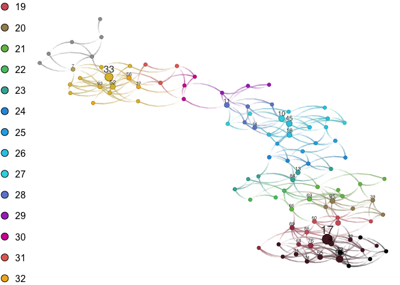
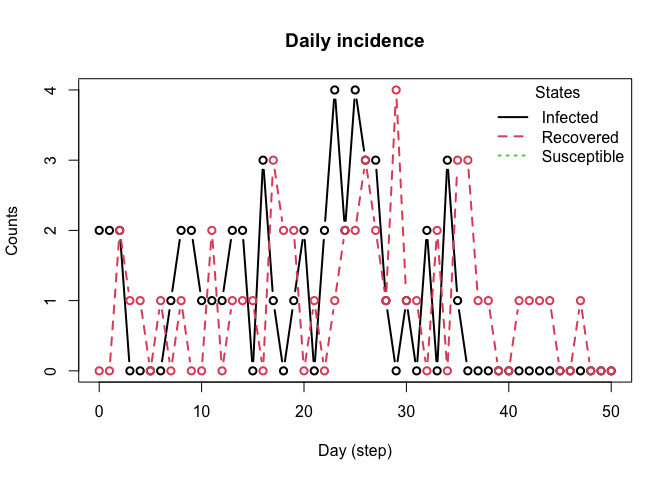
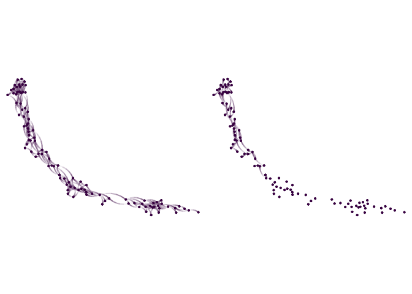

# Example of transmission network
George G. Vega Yon
2024-07-25

We usee a network SIR model with the following parameters:

- Population size (`N`): 100.
- Prevalence: 1/`N`.
- Transmission rate: 0.1.
- Recovery rate: 1/7.

The underlying network is a homophilic network on age with average
degree 11.12.

``` r
library(network)
```


    'network' 1.18.2 (2023-12-04), part of the Statnet Project
    * 'news(package="network")' for changes since last version
    * 'citation("network")' for citation information
    * 'https://statnet.org' for help, support, and other information

``` r
library(ergm) # Simulating an ERGM network
```


    'ergm' 4.6.0 (2023-12-17), part of the Statnet Project
    * 'news(package="ergm")' for changes since last version
    * 'citation("ergm")' for citation information
    * 'https://statnet.org' for help, support, and other information

    'ergm' 4 is a major update that introduces some backwards-incompatible
    changes. Please type 'news(package="ergm")' for a list of major
    changes.

``` r
library(netplot)
```

    Loading required package: grid

``` r
N <- 100
set.seed(121)
age <- sample.int(20, N, replace = TRUE) + 15

g   <- network.initialize(N, directed = FALSE)
g %v% "age" <- age
g <- simulate_formula(g ~ edges + absdiff("age", pow=1.5), coef = c(0, -1))

nplot(g, vertex.color = ~ age)
```



``` r
el <- network::as.edgelist(g)

library(epiworldR)

# Building the model
N <- 100
mymodel <- ModelSIR(
  name = "COVID-19",
  prevalence = 2/N,
  transmission_rate = 0.1,
  # incubation_days = 2,
  recovery_rate = 1/7
)

agents_from_edgelist(
  model = mymodel,
  source = as.integer(el[,1] - 1L),
  target = as.integer(el[,2] - 1L),
  size = N,
  directed = FALSE
)
```

We now run and visualize the model output

``` r
run(mymodel, ndays = 50)
```

    _________________________________________________________________________
    |Running the model...
    |||||||||||||||||||||||||||||||||||||||||||||||||||||||||||||||||||||||| done.
    | done.

``` r
summary(mymodel)
```

    ________________________________________________________________________________
    ________________________________________________________________________________
    SIMULATION STUDY

    Name of the model   : Susceptible-Infected-Recovered (SIR)
    Population size     : 100
    Agents' data        : (none)
    Number of entities  : 0
    Days (duration)     : 50 (of 50)
    Number of viruses   : 1
    Last run elapsed t  : 74.00µs
    Last run speed      : 67.57 million agents x day / second
    Rewiring            : off

    Global events:
     (none)

    Virus(es):
     - COVID-19

    Tool(s):
     (none)

    Model parameters:
     - Recovery rate     : 0.1429
     - Transmission rate : 0.1000

    Distribution of the population at time 50:
      - (0) Susceptible :  98 -> 49
      - (1) Infected    :   2 -> 0
      - (2) Recovered   :   0 -> 51

    Transition Probabilities:
     - Susceptible  0.99  0.01  0.00
     - Infected     0.00  0.82  0.18
     - Recovered    0.00  0.00  1.00

``` r
plot_incidence(mymodel)
```



The network visualization is done using `netplot`. We use the same
layout for both the transmission and contact networks.

``` r
library(igraph)
```


    Attaching package: 'igraph'

    The following object is masked from 'package:netplot':

        ego

    The following objects are masked from 'package:network':

        %c%, %s%, add.edges, add.vertices, delete.edges, delete.vertices,
        get.edge.attribute, get.edges, get.vertex.attribute, is.bipartite,
        is.directed, list.edge.attributes, list.vertex.attributes,
        set.edge.attribute, set.vertex.attribute

    The following objects are masked from 'package:stats':

        decompose, spectrum

    The following object is masked from 'package:base':

        union

``` r
tnetwork <- get_transmissions(mymodel)

tnet <- graph_from_data_frame(
  d = tnetwork[, c("source", "target")],
  vertices = data.frame(name = (1:N) - 1)
)

set.seed(44)
lo <- layout_nicely(intergraph::asIgraph(g))

p1 <- nplot(g, layout = lo, skip.vertex = FALSE, vertex.size = 1, vertex.size.range = c(.01, .01), vertex.label = NA)
p2 <- nplot(tnet, layout = lo, skip.vertex=FALSE, vertex.size = 1, vertex.size.range = c(.01, .01), vertex.label = NA)

gridExtra::grid.arrange(p1, p2, ncol = 2)
```



Finally, we save the networks using rds files.

``` r
saveRDS(g, "contact-network.rds")
saveRDS(tnet, "transmission-network.rds")
```
