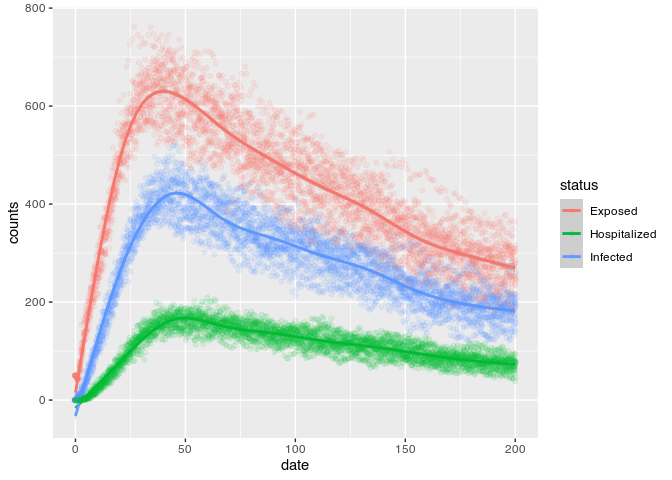

``` r
library(data.table)
library(ggplot2)
```

# Running the model

``` bash
./main.o
```

    ## Starting multiple runs (100)
    ## _________________________________________________________________________
    ## _________________________________________________________________________
    ## ||||||||||||||||||||||||||||||||||||||||||||||||||||||||||||||||||||||||| done.
    ##  done.
    ## 
    ## ________________________________________________________________________________
    ## SIMULATION STUDY
    ## 
    ## Name of the model   : (none)
    ## Population size     : 10000
    ## Number of entitites : 0
    ## Days (duration)     : 100 (of 100)
    ## Number of variants  : 1
    ## Last run elapsed t  : 0.00s
    ## Total elapsed t     : 6.00s (100 runs)
    ## Last run speed      : 16.32 million agents x day / second
    ## Average run speed   : 14.89 million agents x day / second
    ## Rewiring            : off
    ## 
    ## Virus(es):
    ##  - Covid19 (baseline prevalence: 10 seeds)
    ## 
    ## Tool(s):
    ##  (none)
    ## 
    ## Model parameters:
    ##  - Death prob.           : 0.3000
    ##  - Hospitalization prob. : 0.1000
    ##  - Incubation period     : 0.1429
    ## 
    ## Distribution of the population at time 100:
    ##  - (0) Susceptible  :  9990 -> 0
    ##  - (1) Exposed      :    10 -> 0
    ##  - (2) Infected     :     0 -> 0
    ##  - (3) Hospitalized :     0 -> 0
    ##  - (4) Recovered    :     0 -> 8031
    ##  - (5) Deseased     :     0 -> 1969
    ## 
    ## Transition Probabilities:
    ##  - Susceptible   0.81  0.19  0.00  0.00  0.00  0.00
    ##  - Exposed       0.00  0.86  0.14  0.00  0.00  0.00
    ##  - Infected      0.00  0.00  0.68  0.08  0.24  0.00
    ##  - Hospitalized  0.00  0.00  0.00  0.59  0.17  0.24
    ##  - Recovered     0.00  0.00  0.00  0.00  1.00  0.00
    ##  - Deseased      0.00  0.00  0.00  0.00  0.00  1.00

# Computing reproductive number

``` r
rt <- list.files("saves", pattern = "reproductive", full.names = TRUE)
rt <- lapply(seq_along(rt), \(i) {cbind(id = i, fread(rt[i]))}) |>
    rbindlist()

rt <- rt[, .(rt = mean(rt)), by = c("id", "source_exposure_date")]
setorder(rt, source_exposure_date)


ggplot(rt, aes(x = source_exposure_date, y = rt)) +
    geom_smooth()
```

    ## `geom_smooth()` using method = 'gam' and formula 'y ~ s(x, bs = "cs")'

<!-- -->

# Epi curves

``` r
epicurves <- list.files("saves", pattern = "hist", full.names = TRUE)
epicurves <- lapply(seq_along(epicurves), \(i) {
    cbind(id = i, fread(epicurves[i]))
}) |> rbindlist()

ggplot(epicurves, aes(x = date, y = counts)) +
    geom_smooth(aes(colour = status))
```

    ## `geom_smooth()` using method = 'gam' and formula 'y ~ s(x, bs = "cs")'

<!-- -->
