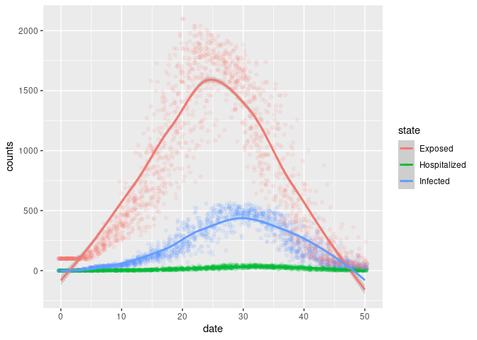

# Description of the model

This is a variation of a SEIRD model, which includes hospitalizations. The specific features follow:

- Two types of network connections: families and bi-partite through entities.
- Individuals are clustered in groups of five.
- Each entity houses 100 individuals.
- Transmission can happen between family members or between entity members.
- At each step, the model draws 5 entity members per susceptible individual. This represents the chance of direct contact.
- Only infected non-hospitalized individuals can transmit the disease.

The current parameters are:

```c++
model.add_param(1.0/7.0, "Incubation period");
model.add_param(.1, "Hospitalization prob.");
model.add_param(.1, "Death prob.");
model.add_param(.5, "Infectiousness"); 
model.add_param(.25, "Infectiousness in entity");
model.add_param(1.0/7.0, "Prob. of Recovery");
```

# Running the model

``` bash
./main.o
```

    ## Starting multiple runs (100)
    ## _________________________________________________________________________
    ## _________________________________________________________________________
    ## ||||||||||||||||||||||||||||||||||||||||||||||||||||||||||||||||||||||||| done.
    ##  done.
    ## 
    ## ________________________________________________________________________________
    ## SIMULATION STUDY
    ## 
    ## Name of the model   : (none)
    ## Population size     : 20000
    ## Number of entitites : 200
    ## Days (duration)     : 200 (of 200)
    ## Number of variants  : 1
    ## Last run elapsed t  : 0.00s
    ## Total elapsed t     : 83.00s (100 runs)
    ## Last run speed      : 5.01 million agents x day / second
    ## Average run speed   : 4.77 million agents x day / second
    ## Rewiring            : off
    ## 
    ## Virus(es):
    ##  - Covid19 (baseline prevalence: 50 seeds)
    ## 
    ## Tool(s):
    ##  (none)
    ## 
    ## Model parameters:
    ##  - Death prob.              : 0.1000
    ##  - Hospitalization prob.    : 0.1000
    ##  - Incubation period        : 0.1429
    ##  - Infectiousness           : 0.5000
    ##  - Infectiousness in entity : 0.2500
    ##  - Prob. of Recovery        : 0.1429
    ## 
    ## Distribution of the population at time 200:
    ##  - (0) Susceptible  : 19950 -> 328
    ##  - (1) Exposed      :    50 -> 5
    ##  - (2) Infected     :     0 -> 11
    ##  - (3) Hospitalized :     0 -> 2
    ##  - (4) Recovered    :     0 -> 16514
    ##  - (5) Deseased     :     0 -> 3140
    ## 
    ## Transition Probabilities:
    ##  - Susceptible   0.98  0.02  0.00  0.00  0.00  0.00
    ##  - Exposed       0.00  0.86  0.14  0.00  0.00  0.00
    ##  - Infected      0.00  0.00  0.79  0.08  0.13  0.00
    ##  - Hospitalized  0.00  0.00  0.00  0.77  0.14  0.09
    ##  - Recovered     0.00  0.00  0.00  0.00  1.00  0.00
    ##  - Deseased      0.00  0.00  0.00  0.00  0.00  1.00

# Computing reproductive number

``` r
rt <- list.files("saves", pattern = "reproductive", full.names = TRUE)
rt <- lapply(seq_along(rt), \(i) {cbind(id = i, fread(rt[i]))}) |>
    rbindlist()

# Computing for each individual
rt <- rt[, .(rt = mean(rt)), by = c("id", "source_exposure_date")]
setorder(rt, source_exposure_date)

ggplot(rt, aes(x = source_exposure_date, y = rt)) +
    geom_jitter(alpha = .1) +
    geom_smooth() +
    lims(y = c(0, 5))
```

    ## `geom_smooth()` using method = 'gam' and formula 'y ~ s(x, bs = "cs")'

    ## Warning: Removed 589 rows containing missing values (geom_point).

<!-- -->

# Epi curves

``` r
epicurves <- list.files("saves", pattern = "hist", full.names = TRUE)
epicurves <- lapply(seq_along(epicurves), \(i) {
    cbind(id = i, fread(epicurves[i]))
}) |> rbindlist()

epicurves[status %in% c("Exposed", "Infected", "Hospitalized")] |>
    ggplot(aes(x = date, y = counts)) +
    geom_smooth(aes(colour = status)) +
    geom_jitter(aes(colour = status), alpha = .1)
```

    ## `geom_smooth()` using method = 'gam' and formula 'y ~ s(x, bs = "cs")'

<!-- -->

``` r
epicurves[!status %in% c("Exposed", "Infected", "Hospitalized")] |>
    ggplot(aes(x = date, y = counts)) +
    geom_smooth(aes(colour = status)) +
    geom_jitter(aes(colour = status), alpha = .1)
```

    ## `geom_smooth()` using method = 'gam' and formula 'y ~ s(x, bs = "cs")'

<!-- -->
