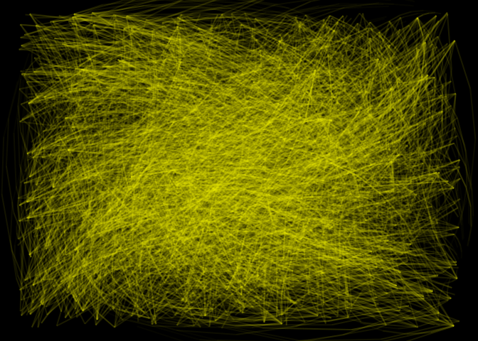

# Description of the model

This is a variation of a SEIRD model, which includes hospitalizations.
The specific features follow:

  - Two types of network connections: families and bi-partite through
    entities.
  - Individuals are clustered in groups of five.
  - Each entity houses 100 individuals.
  - Transmission can happen between family members or between entity
    members.
  - At each step, the model draws 5 entity members per susceptible
    individual. This represents the chance of direct contact.
  - Only infected non-hospitalized individuals can transmit the disease.

The file [`params.txt`](params.txt) contains the model parameters. The
current values are:

| Parameter                |   Value |
| :----------------------- | ------: |
| Gamma shape (incubation) |     7.0 |
| Gamma rate (incubation)  |     1.0 |
| Gamma shape (infected)   |     7.0 |
| Gamma rate (infected)    |     1.0 |
| Hospitalization prob.    |     0.1 |
| Prob. hosp. recovers     |     0.5 |
| Prob. hosp. dies         |     0.5 |
| Infectiousness           |     0.8 |
| Infectiousness in entity |     0.1 |
| Days                     |    50.0 |
| Population Size          | 10000.0 |
| Prevalence               |   100.0 |
| N ties                   |     5.0 |
| Sim count                |   200.0 |
| N entities               |   100.0 |
| Seed                     |    15.0 |
| N interactions           |    10.0 |
| OMP threads              |     8.0 |

The full program can be found in the file [main.cpp](main.cpp).

# Network data

``` r
families <- fread("population.txt")
entities <- fread("agents_entities.txt")[1:2000]

library(igraph)
```

    ## 
    ## Attaching package: 'igraph'

    ## The following objects are masked from 'package:stats':
    ## 
    ##     decompose, spectrum

    ## The following object is masked from 'package:base':
    ## 
    ##     union

``` r
entities[, V2 := V2 + max(V1) + 1]
gr <- graph_from_edgelist(as.matrix(entities) + 1)

library(netplot)
```

    ## Loading required package: grid

    ## 
    ## Attaching package: 'netplot'

    ## The following object is masked from 'package:igraph':
    ## 
    ##     ego

``` r
nplot(gr, sample.edges = .5)
```

<!-- -->

# Running the model

``` bash
./main.o
```

    ## Starting multiple runs (200) using 8 thread(s)
    ## _________________________________________________________________________
    ## _________________________________________________________________________
    ## ||||||||||||||||||||||||||||||||||||||||||||||||||||||||||||||||||||||||| done.
    ##  done.
    ## 
    ## ________________________________________________________________________________
    ## SIMULATION STUDY
    ## 
    ## Name of the model   : (none)
    ## Population size     : 10000
    ## Number of entitites : 100
    ## Days (duration)     : 51 (of 50)
    ## Number of variants  : 1
    ## Last run elapsed t  : 0.00s
    ## Total elapsed t     : 7.00s (200 runs)
    ## Last run speed      : 1.72 million agents x day / second
    ## Average run speed   : 13.21 million agents x day / second
    ## Rewiring            : off
    ## 
    ## Virus(es):
    ##  - Covid19 (baseline prevalence: 100 seeds)
    ## 
    ## Tool(s):
    ##  (none)
    ## 
    ## Model parameters:
    ##  - Days                     : 50.0000
    ##  - Gamma rate (incubation)  : 1.0000
    ##  - Gamma rate (infected)    : 1.0000
    ##  - Gamma shape (incubation) : 7.0000
    ##  - Gamma shape (infected)   : 7.0000
    ##  - Hospitalization prob.    : 0.1000
    ##  - Infectiousness           : 0.8000
    ##  - Infectiousness in entity : 0.1000
    ##  - N entities               : 100.0000
    ##  - N interactions           : 10.0000
    ##  - N ties                   : 5.0000
    ##  - OMP threads              : 8.0000
    ##  - Population Size          : 10000.0000
    ##  - Prevalence               : 100.0000
    ##  - Prob. hosp. dies         : 0.5000
    ##  - Prob. hosp. recovers     : 0.5000
    ##  - Seed                     : 15.0000
    ##  - Sim count                : 200.0000
    ## 
    ## Distribution of the population at time 51:
    ##  - (0) Susceptible  :  9900 -> 201
    ##  - (1) Exposed      :   100 -> 154
    ##  - (2) Infected     :     0 -> 86
    ##  - (3) Hospitalized :     0 -> 8
    ##  - (4) Recovered    :     0 -> 9055
    ##  - (5) Deceased     :     0 -> 496
    ## 
    ## Transition Probabilities:
    ##  - Susceptible   0.93  0.07  0.00  0.00  0.00  0.00
    ##  - Exposed       0.00  0.87  0.13  0.00  0.00  0.00
    ##  - Infected      0.00  0.00  0.56  0.04  0.40  0.00
    ##  - Hospitalized  0.00  0.00  0.00  0.33  0.34  0.33
    ##  - Recovered     0.00  0.00  0.00  0.00  1.00  0.00
    ##  - Deceased      0.00  0.00  0.00  0.00  0.00  1.00

# Computing reproductive number

``` r
rt <- list.files("saves", pattern = "reproductive", full.names = TRUE)
rt <- lapply(seq_along(rt), \(i) {cbind(id = i, fread(rt[i]))}) |>
    rbindlist()

# Computing for each individual
rt <- rt[, .(rt = mean(rt)), by = c("id", "source_exposure_date")]
setorder(rt, source_exposure_date)

rt[, pick := order(runif(.N)), by = .(source_exposure_date)]
rt_sample <- rt[pick <= 200]

ggplot(rt_sample, aes(x = source_exposure_date, y = rt)) +
    geom_jitter(alpha = .1, height = 0) +
    geom_smooth(method = "loess", se = TRUE) +
    lims(y = c(0, 10))
```

    ## `geom_smooth()` using formula = 'y ~ x'

    ## Warning: Removed 25 rows containing non-finite values (`stat_smooth()`).

    ## Warning: Removed 25 rows containing missing values (`geom_point()`).

<!-- -->

``` r
setorder(rt, id, source_exposure_date, rt)
fwrite(rt, "reproductive_numbers.csv")
```

# Epi curves

``` r
epicurves <- list.files("saves", pattern = "hist", full.names = TRUE)
epicurves <- lapply(seq_along(epicurves), \(i) {
    cbind(id = i, fread(epicurves[i]))
}) |> rbindlist()

fwrite(epicurves, "epicurves.csv")

# Samlping
epicurves[, pick := order(runif(.N)), by = .(date, nvariants)]

epicurves_sample <- epicurves[pick <= 200]

epicurves_sample[status %in% c("Exposed", "Infected", "Hospitalized")] |>
    ggplot(aes(x = date, y = counts)) +
    geom_jitter(aes(colour = status), alpha = .1) + 
    geom_smooth(aes(colour = status), method="loess", se = TRUE)
```

    ## `geom_smooth()` using formula = 'y ~ x'

<!-- -->

``` r
epicurves_sample[!status %in% c("Exposed", "Infected", "Hospitalized")] |>
    ggplot(aes(x = date, y = counts)) +
    geom_smooth(aes(colour = status), method = "loess", se = TRUE)
```

    ## `geom_smooth()` using formula = 'y ~ x'

<!-- -->

``` r
    # geom_jitter(aes(colour = status), alpha = .1)
```

Status at the end of the simulation

``` r
epicurves_end <- epicurves[date == max(date)]
epicurves_end[, .(
    Avg     = mean(counts),
    `50%`   = quantile(counts, probs = .5),
    `2.5%`  = quantile(counts, probs = .025),
    `97.5%` = quantile(counts, probs = .975)
    ), by = "status"] |> knitr::kable()
```

| status       |      Avg |    50% |     2.5% |    97.5% |
| :----------- | -------: | -----: | -------: | -------: |
| Susceptible  |  244.535 |  207.5 |  141.900 |  711.675 |
| Exposed      |  326.780 |  187.5 |   46.000 | 1989.300 |
| Infected     |  179.655 |  122.5 |   35.925 |  768.050 |
| Hospitalized |   19.580 |   16.0 |    2.000 |   61.125 |
| Recovered    | 8774.900 | 9011.0 | 6157.375 | 9277.225 |
| Deceased     |  454.550 |  462.0 |  299.925 |  517.175 |
