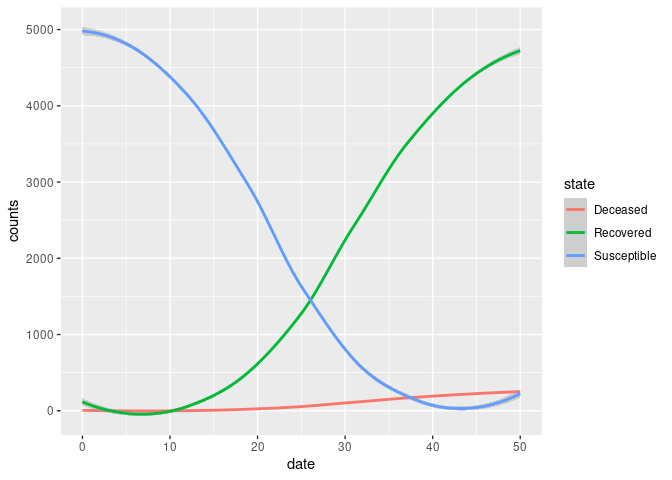

# Description of the model

This is a variation of a SEIRD model, which includes hospitalizations.
The specific features follow:

  - Two types of network connections: families and bi-partite through
    entities.
  - Individuals are clustered in groups of five.
  - Each entity houses 100 individuals.
  - Transmission can happen between family members or between entity
    members.
  - At each step, the model draws 5 entity members per susceptible
    individual. This represents the chance of direct contact.
  - Only infected non-hospitalized individuals can transmit the disease.

The file \[`parameters.txt`\] contains the model parameters. The current
values are:

| Parameter                |    Value |
| :----------------------- | -------: |
| Incubation period        |     0.14 |
| Hospitalization prob.    |     0.10 |
| Death prob.              |     0.10 |
| Infectiousness           |     0.90 |
| Infectiousness in entity |     0.50 |
| Prob. of Recovery        |     0.14 |
| Days                     |   100.00 |
| Population Size          | 10000.00 |
| Prevalence               |   100.00 |
| N ties                   |     5.00 |
| Sim count                |   100.00 |
| N entities               |   100.00 |
| N interactions           |    10.00 |
| Seed                     |  1545.00 |

# Running the model

``` bash
./main.o
```

    ## Starting multiple runs (100)
    ## _________________________________________________________________________
    ## _________________________________________________________________________
    ## ||||||||||||||||||||||||||||||||||||||||||||||||||||||||||||||||||||||||| done.
    ##  done.
    ## 
    ## ________________________________________________________________________________
    ## SIMULATION STUDY
    ## 
    ## Name of the model   : (none)
    ## Population size     : 10000
    ## Number of entitites : 100
    ## Days (duration)     : 100 (of 100)
    ## Number of variants  : 1
    ## Last run elapsed t  : 0.00s
    ## Total elapsed t     : 5.00s (100 runs)
    ## Last run speed      : 17.27 million agents x day / second
    ## Average run speed   : 17.38 million agents x day / second
    ## Rewiring            : off
    ## 
    ## Virus(es):
    ##  - Covid19 (baseline prevalence: 100 seeds)
    ## 
    ## Tool(s):
    ##  (none)
    ## 
    ## Model parameters:
    ##  - Days                     : 100.0000
    ##  - Death prob.              : 0.1000
    ##  - Hospitalization prob.    : 0.1000
    ##  - Incubation period        : 0.1400
    ##  - Infectiousness           : 0.9000
    ##  - Infectiousness in entity : 0.5000
    ##  - N entities               : 100.0000
    ##  - N interactions           : 10.0000
    ##  - N ties                   : 5.0000
    ##  - Population Size          : 10000.0000
    ##  - Prevalence               : 100.0000
    ##  - Prob. of Recovery        : 0.1400
    ##  - Seed                     : 1545.0000
    ##  - Sim count                : 100.0000
    ## 
    ## Distribution of the population at time 100:
    ##  - (0) Susceptible  :  9900 -> 9580
    ##  - (1) Exposed      :   100 -> 0
    ##  - (2) Infected     :     0 -> 0
    ##  - (3) Hospitalized :     0 -> 0
    ##  - (4) Recovered    :     0 -> 340
    ##  - (5) Deseased     :     0 -> 80
    ## 
    ## Transition Probabilities:
    ##  - Susceptible   1.00  0.00  0.00  0.00  0.00  0.00
    ##  - Exposed       0.00  0.85  0.16  0.00  0.00  0.00
    ##  - Infected      0.00  0.00  0.76  0.10  0.14  0.00
    ##  - Hospitalized  0.00  0.00  0.00  0.78  0.13  0.10
    ##  - Recovered     0.00  0.00  0.00  0.00  1.00  0.00
    ##  - Deseased      0.00  0.00  0.00  0.00  0.00  1.00

# Computing reproductive number

``` r
rt <- list.files("saves", pattern = "reproductive", full.names = TRUE)
rt <- lapply(seq_along(rt), \(i) {cbind(id = i, fread(rt[i]))}) |>
    rbindlist()

# Computing for each individual
rt <- rt[, .(rt = mean(rt)), by = c("id", "source_exposure_date")]
setorder(rt, source_exposure_date)

ggplot(rt, aes(x = source_exposure_date, y = rt)) +
    geom_jitter(alpha = .1) +
    geom_smooth() +
    lims(y = c(0, 5))
```

    ## `geom_smooth()` using method = 'gam' and formula = 'y ~ s(x, bs = "cs")'

    ## Warning: Removed 2 rows containing non-finite values (`stat_smooth()`).

    ## Warning: Removed 931 rows containing missing values (`geom_point()`).

    ## Warning: Removed 27 rows containing missing values (`geom_smooth()`).

<!-- -->

# Epi curves

``` r
epicurves <- list.files("saves", pattern = "hist", full.names = TRUE)
epicurves <- lapply(seq_along(epicurves), \(i) {
    cbind(id = i, fread(epicurves[i]))
}) |> rbindlist()

epicurves[status %in% c("Exposed", "Infected", "Hospitalized")] |>
    ggplot(aes(x = date, y = counts)) +
    geom_smooth(aes(colour = status)) +
    geom_jitter(aes(colour = status), alpha = .1)
```

    ## `geom_smooth()` using method = 'gam' and formula = 'y ~ s(x, bs = "cs")'

<!-- -->

``` r
epicurves[!status %in% c("Exposed", "Infected", "Hospitalized")] |>
    ggplot(aes(x = date, y = counts)) +
    geom_smooth(aes(colour = status)) +
    geom_jitter(aes(colour = status), alpha = .1)
```

    ## `geom_smooth()` using method = 'gam' and formula = 'y ~ s(x, bs = "cs")'

<!-- -->
