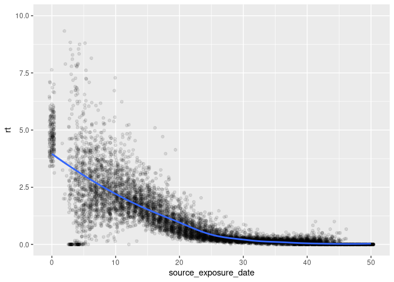

``` r
library(data.table)
library(ggplot2)
```

# Computing reproductive number

``` r
rt <- fread("repnumber.txt")
rt <- rt[, .(rt = mean(rt)), by = "source_exposure_date"]
setorder(rt, source_exposure_date)

plot(rt)
```

<!-- -->

# Epi curves

``` r
epicurves <- fread("total_hist.txt")

ggplot(epicurves, aes(x = date, y = counts)) +
    geom_line(aes(colour = status))
```

<!-- -->
