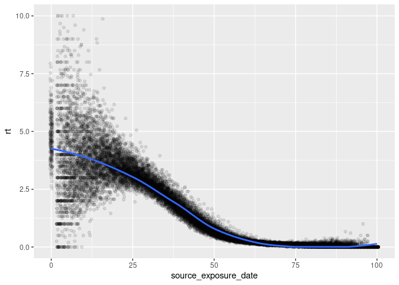

# Description of the model

This is a variation of a SEIRD model, which includes hospitalisations.
The specific features follow:

- Two types of network connections: families and bi-partite through
  entities.
- Individuals are clustered in groups of five.
- Each entity houses 100 individuals.
- Transmission can happen between family members or between entity
  members.
- The model draws five entity members per susceptible individual at each
  step. This represents the chance of direct contact.
- Only infected non-hospitalized individuals can transmit the disease.

The full program can be found in the file [main.cpp](main.cpp).

# Running the model

``` bash
./main.o
```

    Starting multiple runs (200) using 4 thread(s)
    _________________________________________________________________________
    _________________________________________________________________________
    ||||||||||||||||||||||||||||||||||||||||||||||||||||||||||||||||||||||||| done.
     done.

    ________________________________________________________________________________
    SIMULATION STUDY

    Name of the model   : Susceptible-Exposed-Infected-Removed (SEIR) (connected)
    Population size     : 20000
    Number of entities  : 0
    Days (duration)     : 100 (of 100)
    Number of variants  : 1
    Last run elapsed t  : 0.00s
    Total elapsed t     : 14.00s (200 runs)
    Last run speed      : 10.08 million agents x day / second
    Average run speed   : 28.53 million agents x day / second
    Rewiring            : off

    Global actions:
     (none)

    Virus(es):
     - model-rt2 (baseline prevalence: 0.10%)

    Tool(s):
     (none)

    Model parameters:
     - Avg. Incubation days : 7.0000
     - Contact rate         : 2.0000
     - Prob. Recovery       : 0.1429
     - Prob. Transmission   : 0.3000

    Distribution of the population at time 100:
      - (0) Susceptible : 19980 -> 400
      - (1) Exposed     :    20 -> 76
      - (2) Infected    :     0 -> 237
      - (3) Recovered   :     0 -> 19287

    Transition Probabilities:
     - Susceptible  0.96  0.04  0.00  0.00
     - Exposed      0.00  0.86  0.14  0.00
     - Infected     0.00  0.00  0.86  0.14
     - Recovered    0.00  0.00  0.00  1.00

# Computing reproductive number

``` r
rt <- list.files("saves", pattern = "reproductive", full.names = TRUE)
rt <- lapply(seq_along(rt), \(i) {cbind(id = i, fread(rt[i]))}) |>
    rbindlist()

# Computing for each individual
rt <- rt[, .(rt = mean(rt)), by = c("id", "source_exposure_date")]
setorder(rt, source_exposure_date)

rt[, pick := order(runif(.N)), by = .(source_exposure_date)]
rt_sample <- rt[pick <= 200]

ggplot(rt_sample, aes(x = source_exposure_date, y = rt)) +
    geom_jitter(alpha = .1, height = 0) +
    geom_smooth(method = "loess", se = TRUE) +
    lims(y = c(0, 10))
```

    `geom_smooth()` using formula = 'y ~ x'

    Warning: Removed 20 rows containing non-finite values (`stat_smooth()`).

    Warning: Removed 20 rows containing missing values (`geom_point()`).

    Warning: Removed 12 rows containing missing values (`geom_smooth()`).



``` r
setorder(rt, id, source_exposure_date, rt)
fwrite(rt, "reproductive_numbers.csv")
```

# Generation time

``` r
gentime <- list.files("saves", pattern = "gene", full.names = TRUE)
gentime <- lapply(seq_along(gentime), \(i) {
    tmp <- cbind(id = i, fread(gentime[i]))
    tmp[gentime > 0]
}) |> rbindlist()

gentime <- gentime[, .(gtime = mean(gentime)), by = .(id, source_exposure_date)]

ggplot(gentime, aes(x = source_exposure_date, y = gtime)) +
    geom_jitter(alpha = .1, height = 0) +
    geom_smooth(method = "loess", se = TRUE) +
    lims(y = c(0, 10))
```

    `geom_smooth()` using formula = 'y ~ x'

    Warning: Removed 3266 rows containing non-finite values (`stat_smooth()`).

    Warning: Removed 3266 rows containing missing values (`geom_point()`).


``` r
fwrite(gentime, "generation_time.csv")
```

# New daily cases

Daily cases can be informed through the transition matrix.

``` r
transition <- list.files("saves", pattern = "transit", full.names = TRUE)
transition <- lapply(seq_along(transition), \(i) {
    cbind(id = i, fread(transition[i]))
}) |> rbindlist()

transition[, ttrans := fifelse(
    from == "Susceptible" & to == "Exposed",
    "New exposures",
    fifelse(
        from == "Exposed" & to == "Infected",
        "New infections",
        fifelse(
            (from == "Infected" & to == "Recovered") | (from == "Hospitalized" & to == "Recovered"),
            "New recovered",
            fifelse(
                from == "Infected" & to == "Hospitalized",
                "New hospitalized",
                fifelse(
                    from == "Hospitalized" & to == "Deceased",
                    "New deaths",
                    "(other)"
                )
            )
        )
    )
    )]

# File with transitions
transition_file <- transition[from != to]
transition_file <- 
    transition_file[, transition := paste0(from, "_", to)] |>
        dcast(id + date ~ transition, value.var = "counts")

fwrite(transition_file, "transitions.csv")

transition <- transition[ttrans != "(other)"]

# sampling
transition[, pick := order(runif(.N)), by = .(date, ttrans)]
transition <- transition[pick <= 100]
transition |>
    ggplot(aes(x = date, y = counts)) +
    geom_jitter(aes(colour = ttrans), alpha = .1) + 
    geom_smooth(aes(colour = ttrans), method="loess", se = TRUE)
```

    `geom_smooth()` using formula = 'y ~ x'


# Epi curves

``` r
epicurves <- list.files("saves", pattern = "hist", full.names = TRUE)
epicurves <- lapply(seq_along(epicurves), \(i) {
    cbind(id = i, fread(epicurves[i]))
}) |> rbindlist()

fwrite(epicurves, "epicurves.csv")

# Samlping
epicurves[, pick := order(runif(.N)), by = .(date, nvariants)]

epicurves_sample <- epicurves[pick <= 200]

epicurves_sample[state %in% c("Exposed", "Infected", "Hospitalized")] |>
    ggplot(aes(x = date, y = counts)) +
    geom_jitter(aes(colour = state), alpha = .1) + 
    geom_smooth(aes(colour = state), method="loess", se = TRUE)
```

    `geom_smooth()` using formula = 'y ~ x'


``` r
epicurves_sample[!state %in% c("Exposed", "Infected", "Hospitalized")] |>
    ggplot(aes(x = date, y = counts)) +
    geom_smooth(aes(colour = state), method = "loess", se = TRUE)
```

    `geom_smooth()` using formula = 'y ~ x'


``` r
    # geom_jitter(aes(colour = status), alpha = .1)
```

States at the end of the simulation

``` r
epicurves_end <- epicurves[date == max(date)]
epicurves_end[, .(
    Avg     = mean(counts),
    `50%`   = quantile(counts, probs = .5),
    `2.5%`  = quantile(counts, probs = .025),
    `97.5%` = quantile(counts, probs = .975)
    ), by = "state"] |> knitr::kable()
```

| state       |       Avg |     50% |      2.5% |     97.5% |
|:------------|----------:|--------:|----------:|----------:|
| Susceptible |   378.970 |   376.5 |   334.975 |   429.000 |
| Exposed     |    74.125 |    70.5 |    44.975 |   119.000 |
| Infected    |   234.190 |   229.0 |   144.925 |   357.275 |
| Recovered   | 19312.715 | 19318.5 | 19139.550 | 19452.050 |
