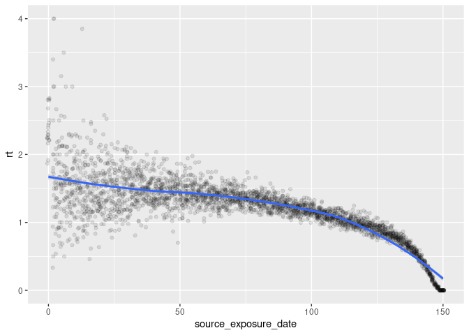
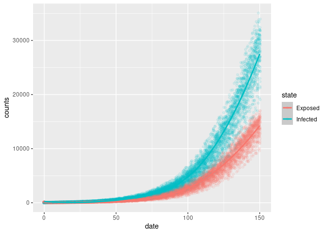

# Description of the model[^1]

This is a piece of R code that sets up a model for an infectious disease
using the SEIR (Susceptible, Exposed, Infectious, Recovered) model with
connections.

The first part of the code defines several variables:

- `n` is the total population size, set to 20,000.
- `preval` is the initial fraction of the population that is infected,
  set to 0.001.
- `crate` is the contact rate, set to 2.0. This is the average number of
  contacts per person per time.
- `trate` is the transmission probability, set to 0.3. This is the
  probability that the disease transmits between people in contact.
- `incu` is the average number of days of incubation, set to 7.0.
- `rrate` is the recovery rate, set to 1/7. This is the rate at which
  infected individuals recover and become immune.

The second part of the code creates an instance of the `ModelSEIRCONN`
class, named “SEIR with test”. This model is initialized with the
parameters defined above.

# Running the model

``` r
# Reading in parameters
n      <- 1e5      # Population size
preval <- 100/n    # Initial infected fraction
crate  <- 5.0      # Contact Rate
incu   <- 3.0      # Avg incubation
rrate  <- 1.0/7.0  # Recovery rate
R0     <- 1.5      # Basic reproductive number
trate  <- R0 * rrate / crate

mymodel <- ModelSEIRCONN(
  name              = "SEIR with test",
  n                 = n,
  prevalence        = preval,
  contact_rate      = crate,
  transmission_rate = trate,
  incubation_days   = incu,
  recovery_rate     = rrate
  )

saver <- make_saver(
  "total_hist",
  "transmission",
  "transition",
  "reproductive",
  "generation"
)

set.seed(331)
run_multiple(mymodel, ndays = 150, nsims = 200, saver = saver, nthreads = 8)
```

    Starting multiple runs (200) using 8 thread(s)
    _________________________________________________________________________
    _________________________________________________________________________
    ||||||||||||||||||||||||||||||||||||||||||||||||||||||||||||||||||||||||| done.
     done.

Looking into the results

``` r
summary(mymodel)
```

    ________________________________________________________________________________
    ________________________________________________________________________________
    SIMULATION STUDY

    Name of the model   : Susceptible-Exposed-Infected-Removed (SEIR) (connected)
    Population size     : 100000
    Agents' data        : (none)
    Number of entities  : 0
    Days (duration)     : 150 (of 150)
    Number of viruses   : 1
    Last run elapsed t  : 1.00s
    Total elapsed t     : 57.00s (200 runs)
    Last run speed      : 11.84 million agents x day / second
    Average run speed   : 52.10 million agents x day / second
    Rewiring            : off

    Global events:
     - Update infected individuals (runs daily)

    Virus(es):
     - SEIR with test

    Tool(s):
     (none)

    Model parameters:
     - Avg. Incubation days : 3.0000
     - Contact rate         : 5.0000
     - Prob. Recovery       : 0.1429
     - Prob. Transmission   : 0.0429

    Distribution of the population at time 150:
      - (0) Susceptible :  99900 -> 56182
      - (1) Exposed     :    100 -> 1426
      - (2) Infected    :      0 -> 3753
      - (3) Recovered   :      0 -> 38639

    Transition Probabilities:
     - Susceptible  1.00  0.00  0.00  0.00
     - Exposed      0.00  0.67  0.33  0.00
     - Infected     0.00  0.00  0.85  0.15
     - Recovered    0.00  0.00  0.00  1.00

``` r
# Retrieving the results
res <- run_multiple_get_results(mymodel)
```

# Computing reproductive number

``` r
rt <- data.table(res$reproductive)

# Renaming
setnames(rt, "sim_num", "id")

rt <- rt[, .(rt = mean(rt)), by = c("id", "source_exposure_date")]
setorder(rt, source_exposure_date)

rt[, pick := order(runif(.N)), by = .(source_exposure_date)]
rt_sample <- rt[pick <= 20]
rt[, pick := NULL]

ggplot(rt_sample, aes(x = source_exposure_date, y = rt)) +
    geom_jitter(alpha = .1, height = 0) +
    geom_smooth(method = "loess", se = TRUE)
```

    `geom_smooth()` using formula = 'y ~ x'



``` r
setorder(rt, id, source_exposure_date, rt)
fwrite(rt, "reproductive_numbers.gz", )
```

``` r
rt[, .(rt = mean(rt)), by = "source_exposure_date"] |>
  ggplot(aes(x = source_exposure_date, y = rt)) +
  geom_line() +
  geom_abline(slope=0, intercept = R0, linetype = "dashed") +
  geom_text(aes(label = "R0"), x = 50, y = R0 + 0.1, size = 3)
```

    Warning in geom_text(aes(label = "R0"), x = 50, y = R0 + 0.1, size = 3): All aesthetics have length 1, but the data has 150 rows.
    ℹ Please consider using `annotate()` or provide this layer with data containing
      a single row.


# Generation time

``` r
gentime <- data.table(res$generation)
setnames(gentime, "sim_num", "id")

# Removing negative values
gentime <- gentime[gentime > 0]
gentime <- gentime[, .(gtime = mean(gentime)), by = .(id, source_exposure_date)]

# Sampling
gentime[, pick := order(runif(.N)), by = .(source_exposure_date)]
gentime_sample <- gentime[pick <= 20]
gentime[, pick := NULL]

ggplot(gentime_sample, aes(x = source_exposure_date, y = gtime)) +
    geom_jitter(alpha = .1, height = 0) +
    geom_smooth(method = "loess", se = TRUE) +
    lims(y = c(0, 10))
```

    `geom_smooth()` using formula = 'y ~ x'

    Warning: Removed 4 rows containing non-finite outside the scale range
    (`stat_smooth()`).

    Warning: Removed 4 rows containing missing values or values outside the scale range
    (`geom_point()`).


``` r
fwrite(gentime, "generation_time.gz")
```

# New daily cases

Daily cases can be informed through the transition matrix.

``` r
transition <- data.table(res$transition)
setnames(transition, "sim_num", "id")

transition[, ttrans := fifelse(
    from == "Susceptible" & to == "Exposed",
    "New exposures",
    fifelse(
        from == "Exposed" & to == "Infected",
        "New infections",
        fifelse(
            (from == "Infected" & to == "Recovered") | (from == "Hospitalized" & to == "Recovered"),
            "New recovered",
            fifelse(
                from == "Infected" & to == "Hospitalized",
                "New hospitalized",
                fifelse(
                    from == "Hospitalized" & to == "Deceased",
                    "New deaths",
                    "(other)"
                )
            )
        )
    )
    )]

# File with transitions
transition_file <- transition[from != to]
transition_file <- 
    transition_file[, transition := paste0(from, "_", to)] |>
        dcast(id + date ~ transition, value.var = "counts")

fwrite(transition_file, "transitions.gz")

transition <- transition[ttrans != "(other)"]

# sampling
transition[, pick := order(runif(.N)), by = .(date, ttrans)]
transition <- transition[pick <= 10]
transition |>
    ggplot(aes(x = date, y = counts)) +
    geom_jitter(aes(colour = ttrans), alpha = .1) + 
    geom_smooth(aes(colour = ttrans), method="loess", se = TRUE)
```

    `geom_smooth()` using formula = 'y ~ x'


# Epi curves

``` r
epicurves <- data.table(res$total_hist)
setnames(epicurves, "sim_num", "id")

fwrite(epicurves, "epicurves.gz")

# Samlping
epicurves[, pick := order(runif(.N)), by = .(date, nviruses)]

epicurves_sample <- epicurves[pick <= 200]

epicurves_sample[state %in% c("Exposed", "Infected", "Hospitalized")] |>
    ggplot(aes(x = date, y = counts)) +
    geom_jitter(aes(colour = state), alpha = .1) + 
    geom_smooth(aes(colour = state), method="loess", se = TRUE)
```

    `geom_smooth()` using formula = 'y ~ x'



``` r
epicurves_sample[!state %in% c("Exposed", "Infected", "Hospitalized")] |>
    ggplot(aes(x = date, y = counts)) +
    geom_smooth(aes(colour = state), method = "loess", se = TRUE)
```

    `geom_smooth()` using formula = 'y ~ x'


``` r
    # geom_jitter(aes(colour = status), alpha = .1)
```

States at the end of the simulation

``` r
epicurves_end <- epicurves[date == max(date)]
epicurves_end[, .(
    Avg     = mean(counts),
    `50%`   = quantile(counts, probs = .5),
    `2.5%`  = quantile(counts, probs = .025),
    `97.5%` = quantile(counts, probs = .975)
    ), by = "state"] |> knitr::kable()
```

| state       |       Avg |     50% |     2.5% |     97.5% |
|:------------|----------:|--------:|---------:|----------:|
| Susceptible | 54320.595 | 53979.5 | 50121.35 | 60427.575 |
| Exposed     |  1330.415 |  1311.0 |  1026.40 |  1655.475 |
| Infected    |  3546.225 |  3533.0 |  2951.10 |  4160.925 |
| Recovered   | 40802.765 | 41093.0 | 33607.43 | 45875.375 |

[^1]: The description of the model was generated by GitHub copilot
