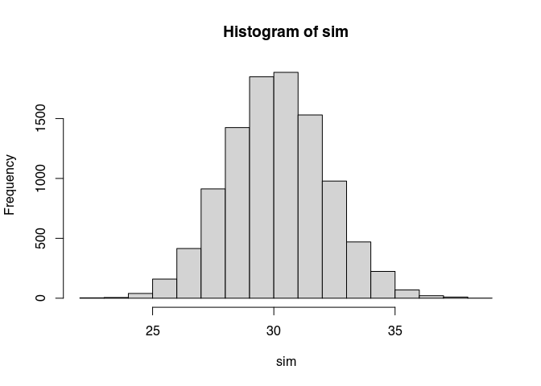

## population.R

The `population.R` script generates an artificial population for the
epidemiological model. Here we use the data from Toth *et al.* (2021),
in particular, the distribution of household sizes in Salt Lake City.
The simulation has two parts: sampling the households and
interconnecting individuals between the households.

### Simulating households

1.  Set a desired population size, `N_desired`, number of locations,
    `N_locations`, and number of visits each individual does,
    `N_avg_locations`.

2.  Using the data from Toth *et al.*, retrieve a weighed sample of
    households using the observed frequencies as weights.

3.  Select the first `H` households sampled such that the sum of their
    sizes is at most `N_desired`.

4.  If the sum of the household sizes is less than `N_desired`, add
    assign the difference to the last household.

### Interconnecting households

There are many strategies possible to interconnect individuals between
households. At this time, we will connect individuals based on
co-afiliation networks, in particular, we will assign individuals to
locations at random and create ties between those who co-occurr.

One problem with this approach is that, as the population size
increases, the average number of connections grows as well. Having a
network with a significantly high mean degree is not desired as in
reality density decreases with size.

To formally analyze this, we can calculate the expected mean degree as a
function of the number of locations in the system and mean number of
locations individuals go to. Let

denote a population of size
,

the set of

locations, and

the mean number of visits per individual, with
").
Assuming all. Let
;
the probability that individuals

and

visit the same place can be computed as follows:

![
\\begin{align\*}
P(i\\leftrightarrow k) & = 1 - P(\\neg i \\leftrightarrow k) \\\\
& = 1 - \\prod_m P(\\mbox{not both in }m) \\\\
& = 1 - \\prod_m \[1 - P(\\mbox{both in }m)\] \\\\
& = 1 - \\prod_m \[1 - P(i\\in m, k\\in m)\] \\\\
& = 1 - \\prod_m \[1 - P(i\\in m) P(j\\in m)\] \\\\
& \\mbox{Since both are symmetrical} \\\\
& = 1 - \\prod_m (1 - (\\mu_v/m)^2) \\\\
& = 1 - \[1 - (\\mu_v/m)^2\]^{m}
\\end{align\*}
](https://latex.codecogs.com/png.image?%5Cdpi%7B110%7D&space;%5Cbg_white&space;%0A%5Cbegin%7Balign%2A%7D%0AP%28i%5Cleftrightarrow%20k%29%20%26%20%3D%201%20-%20P%28%5Cneg%20i%20%5Cleftrightarrow%20k%29%20%5C%5C%0A%26%20%3D%201%20-%20%5Cprod_m%20P%28%5Cmbox%7Bnot%20both%20in%20%7Dm%29%20%5C%5C%0A%26%20%3D%201%20-%20%5Cprod_m%20%5B1%20-%20P%28%5Cmbox%7Bboth%20in%20%7Dm%29%5D%20%5C%5C%0A%26%20%3D%201%20-%20%5Cprod_m%20%5B1%20-%20P%28i%5Cin%20m%2C%20k%5Cin%20m%29%5D%20%5C%5C%0A%26%20%3D%201%20-%20%5Cprod_m%20%5B1%20-%20P%28i%5Cin%20m%29%20P%28j%5Cin%20m%29%5D%20%5C%5C%0A%26%20%5Cmbox%7BSince%20both%20are%20symmetrical%7D%20%5C%5C%0A%26%20%3D%201%20-%20%5Cprod_m%20%281%20-%20%28%5Cmu_v%2Fm%29%5E2%29%20%5C%5C%0A%26%20%3D%201%20-%20%5B1%20-%20%28%5Cmu_v%2Fm%29%5E2%5D%5E%7Bm%7D%0A%5Cend%7Balign%2A%7D%0A "
\begin{align*}
P(i\leftrightarrow k) & = 1 - P(\neg i \leftrightarrow k) \\
& = 1 - \prod_m P(\mbox{not both in }m) \\
& = 1 - \prod_m [1 - P(\mbox{both in }m)] \\
& = 1 - \prod_m [1 - P(i\in m, k\in m)] \\
& = 1 - \prod_m [1 - P(i\in m) P(j\in m)] \\
& \mbox{Since both are symmetrical} \\
& = 1 - \prod_m (1 - (\mu_v/m)^2) \\
& = 1 - [1 - (\mu_v/m)^2]^{m}
\end{align*}
")

This way, the expected degree of the system is then

![
\\begin{align\*}
\\mathbb{E}(degree) & = \\left\[1 - \[1 - (\\mu_v/m)^2\]^{m}\\right\]\\times(N - 1)
\\end{align\*}
](https://latex.codecogs.com/png.image?%5Cdpi%7B110%7D&space;%5Cbg_white&space;%0A%5Cbegin%7Balign%2A%7D%0A%5Cmathbb%7BE%7D%28degree%29%20%26%20%3D%20%5Cleft%5B1%20-%20%5B1%20-%20%28%5Cmu_v%2Fm%29%5E2%5D%5E%7Bm%7D%5Cright%5D%5Ctimes%28N%20-%201%29%0A%5Cend%7Balign%2A%7D%0A "
\begin{align*}
\mathbb{E}(degree) & = \left[1 - [1 - (\mu_v/m)^2]^{m}\right]\times(N - 1)
\end{align*}
")

Furthermore, the degree is distributed binomial with mean
![1 - \[1 - (\\mu_v/m)^2\]^m](https://latex.codecogs.com/png.image?%5Cdpi%7B110%7D&space;%5Cbg_white&space;1%20-%20%5B1%20-%20%28%5Cmu_v%2Fm%29%5E2%5D%5Em "1 - [1 - (\mu_v/m)^2]^m")
and size

(which explains the result we obtained with the expected degree).

As the number of individuals grows so does mean degree. In this case, if
we wire the individuals through a bipartite graph, then we have to take
into consideration that individuals may tend then to have a large number
of connections in large systems, which may not reflect reality.


From the figure we can see that, for example, in a system with 50,000
agents, 400 locations, and each visiting an average of two locations,
the expected degree is 498.

## Appendix

### Checking predicted mean degree

The following code-block performs a brief simulation study to validate
this result:

``` r
library(data.table)
n    <- 400
m    <- 50
mu_v <- 1

expected_deg(n, m, mu_v)
```

    ## [1] 7.902294

``` r
# Running a simulation
set.seed(7123)
N     <- 1:n
nsims <- 10000
M     <- 1:m

Visits <- array(runif(n * m * nsims) < mu_v/m, dim = c(n, m, nsims))

sim <- parallel::mclapply(1:nsims, \(i) {
  
  # Sampling per individual
  visits <- which(Visits[,,i], arr.ind = TRUE)

  visits <- data.table(
    id = visits[,1],
    loc = visits[,2]
  )

  # Creating the bipartite graph  
  visits <- merge(
    visits[, .(ego = id, loc)],
    visits[, .(alter = id, loc)],
    by = "loc", allow.cartesian = TRUE, all = TRUE
  )[, loc:=NULL] |> unique()
  
  # Retrieving the edgelist
  visits <- visits[, .(ego = fifelse(ego > alter, ego, alter), alter = fifelse(ego > alter, alter, ego))]
  visits <- unique(visits)[ego != alter,]
  
  # Calculating the degree
  sum(table(visits[,c(ego, alter)]))/n
  
}, mc.cores = 6L) |> unlist()

hist(sim)
```

<!-- -->

``` r
mean(sim)
```

    ## [1] 7.899339
