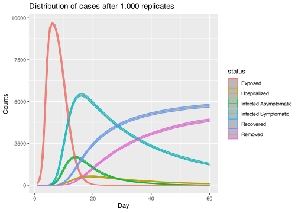

# Model 0 for Salt Lake City

``` bash
./00main.o
```

    ## Starting multiple runs (1000)
    ## _________________________________________________________________________
    ## _________________________________________________________________________
    ## ||||||||||||||||||||||||||||||||||||||||||||||||||||||||||||||||||||||||| done.
    ##  done.
    ## 
    ## ________________________________________________________________________________
    ## SIMULATION STUDY
    ## 
    ## Population size    : 10000
    ## Days (duration)    : 100 (of 100)
    ## Number of variants : 1
    ## Last run elapsed t : 0.00s
    ## Total elapsed t    : 4.00s (1000 runs)
    ## Rewiring           : off
    ## 
    ## Virus(es):
    ##  - Omicron (baseline prevalence: 5.00%)
    ## 
    ## Tool(s):
    ##  (none)
    ## 
    ## Model parameters:
    ##  - Prob. Infecting : 0.9000
    ##  - Prob. Recovery  : 0.1429
    ##  - Prob. death     : 0.0100
    ## 
    ## Distribution of the population at time 100:
    ## - (0) Susceptible :  9500 -> 8080
    ## - (1) Exposed     :   500 -> 0
    ## - (2) Infected    :     0 -> 0
    ## - (3) Recovered   :     0 -> 1816
    ## - (4) Removed     :     0 -> 104

``` r
library(data.table)
library(ggplot2)
dat <- fread("00main-results.csv")
dat <- melt(dat, id.vars = "replica")

ggplot(dat, aes(y = value, x = variable)) +
    geom_boxplot() +
    labs(
        x = "State", y = "Counts (out of 10,000)",
        title = "Distribution of cases after 1,000 replicates"
        )
```

<!-- -->
