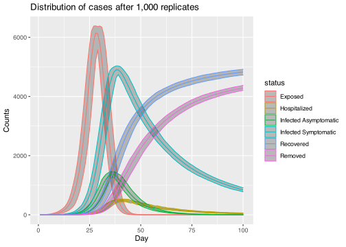

# Model 0 for Salt Lake City

This simulation model features the following:

1.  Five different states: Susceptible, Exposed, Infected, Recovered,
    and Removed.

2.  The population size is 10,000 individuals, all connected at the
    household level, and between households.

3.  A baseline probability of infection is .9.

4.  Daily recovery rate for an infected agent is `1/7`.

5.  Daily death rate for an infected agent is .01.

6.  There is one virus that starts with 5% of the population exposed.

7.  The simulation lasts 100 days, and replicated a thousand times.

The implementation details can be found in [00main.cpp](00main.cpp).
After compilation, the execution of the program results in the following
output:

``` bash
./00main.o
```

    ## Starting multiple runs (1000)
    ## _________________________________________________________________________
    ## _________________________________________________________________________
    ## ||||||||||||||||||||||||||||||||||||||||||||||||||||||||||||||||||||||||| done.
    ##  done.
    ## 
    ## ________________________________________________________________________________
    ## SIMULATION STUDY
    ## 
    ## Population size    : 10000
    ## Days (duration)    : 60 (of 60)
    ## Number of variants : 1
    ## Last run elapsed t : 0.00s
    ## Total elapsed t    : 6.00s (1000 runs)
    ## Rewiring           : off
    ## 
    ## Virus(es):
    ##  - Omicron (baseline prevalence: 5.00%)
    ## 
    ## Tool(s):
    ##  - Mask (baseline prevalence: 30.00%)
    ##  - Vaccine (baseline prevalence: 60.00%)
    ## 
    ## Model parameters:
    ##  - Mask redux transmission   : 0.8000
    ##  - Prob. Hospitalization     : 0.0500
    ##  - Prob. Infecting           : 0.9000
    ##  - Prob. Recovery            : 0.1429
    ##  - Prob. death               : 0.0100
    ##  - Recovery enhance          : 0.0e+00
    ##  - Vax Death redux           : 0.9500
    ##  - Vax Efficacy              : 0.9000
    ##  - Vax Efficacy decay        : 0.5000
    ##  - Vax Prob. Hospitalization : 0.0100
    ##  - Vax Recovery enhance      : 0.5000
    ## 
    ## Distribution of the population at time 60:
    ## - (0) Susceptible           :  9500 -> 8093
    ## - (1) Exposed               :   500 -> 0
    ## - (2) Infected Asymptomatic :     0 -> 0
    ## - (3) Infected Symptomatic  :     0 -> 0
    ## - (4) Hospitalized          :     0 -> 0
    ## - (5) Recovered             :     0 -> 1864
    ## - (6) Removed               :     0 -> 43

Statuses’ trajectories have the following distribution:

<!-- -->
